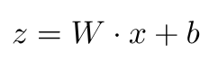
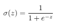
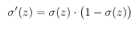
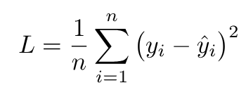
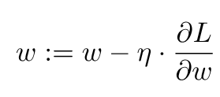

# Mi Primera Red Neuronal en Python

Este proyecto implementa una red neuronal desde cero usando únicamente `numpy`.  
El objetivo es mostrar, paso a paso, cómo funciona una red neuronal y cómo se relaciona con el cálculo multivariado.

---

## Introducción

Una red neuronal artificial es un modelo matemático inspirado en el cerebro humano.  
Se compone de capas de neuronas artificiales, que transforman datos de entrada en una salida.

Estructura típica:

1. **Capa de entrada** → recibe los datos (x₁, x₂, ...).  
2. **Capas ocultas** → procesan y aprenden representaciones intermedias.  
3. **Capa de salida** → da el resultado final (ejemplo: 0 o 1).  

---

## Relación con Cálculo Multivariado

Las redes neuronales están directamente relacionadas con conceptos de cálculo multivariado:

- La red es una **función multivariable**:  
  f(x; W, b)

- El entrenamiento consiste en **optimizar una función multivariable**:  
  minimizar la función de pérdida L(W, b).

- Conceptos aplicados:
  - **Derivadas parciales**: cómo cambia el error respecto a cada peso.  
  - **Gradiente**: vector que agrupa todas las derivadas parciales.  
  - **Regla de la cadena**: utilizada en backpropagation para derivar funciones compuestas.  
  - **Optimización**: gradiente descendente para encontrar mínimos locales.  

---

## Flujo de funcionamiento

### Diagrama conceptual

X → [W1, b1] → Sigmoide → a1 → [W2, b2] → Sigmoide → a2 → 
Comparación con y → Pérdida L → Gradientes → Actualización → Repetir

---

## Pasos matemáticos

1. **Propagación hacia adelante (Forward Pass)**  
   - Operación lineal:  
   <p align="center">
     
   </p>

   - Activación no lineal (sigmoide):  
   <p align="center">
     
   </p>

2. **Derivada de la sigmoide**  
   <p align="center">
     
   </p>

3. **Función de pérdida (Error cuadrático medio)**  
   <p align="center">
     
   </p>

4. **Backpropagation (Regla de la cadena)**  
   <p align="center">
     
   </p>

5. **Actualización de parámetros (Gradiente descendente)**  
   <p align="center">
     
   </p>

---

## Código explicado (`src/red.py`)

En esta sección se detalla cómo funciona cada bloque del archivo `src/red.py`.  
El código implementa una red neuronal simple para resolver el problema XOR.

### Funciones de activación
```
def sigmoid(x): 
    return 1 / (1 + np.exp(-x))

def sigmoid_deriv(x): 
    return x * (1 - x)
```
---

### Datos de entrenamiento
```
X = np.array([[0,0],[0,1],[1,0],[1,1]])
y = np.array([[0],[1],[1],[0]])
```
Este bloque define el conjunto de datos que la red va a aprender.

X son las entradas (pares de bits).

y son las salidas esperadas según la operación XOR.
Este problema no es linealmente separable, por eso necesitamos una capa oculta.

### Inicialización de parámetros
```
W1 = np.random.randn(2,3)
b1 = np.zeros((1,3))
W2 = np.random.randn(3,1)
b2 = np.zeros((1,1))
```
Aquí se crean los pesos (W1, W2) y los sesgos (b1, b2):

W1, b1 conectan la capa de entrada con la capa oculta (2 → 3).

W2, b2 conectan la capa oculta con la de salida (3 → 1).
Se inicializan con valores aleatorios (pesos) y ceros (sesgos).

### Forward pass
```
z1 = np.dot(X, W1) + b1
a1 = sigmoid(z1)

z2 = np.dot(a1, W2) + b2
a2 = sigmoid(z2)
```
La propagación hacia adelante calcula la salida de la red:

Se obtiene la activación de la capa oculta (a1).

Se calcula la salida final (a2).

### Función de pérdida
```
loss = np.mean((y - a2) ** 2)
```
Se usa el Error Cuadrático Medio (MSE) para medir qué tan cerca está la salida de la red de los valores esperados.

### Backpropagation
```
error = y - a2
d_a2 = error * sigmoid_deriv(a2)

error_hidden = d_a2.dot(W2.T)
d_a1 = error_hidden * sigmoid_deriv(a1)
```
Aquí se aplica la regla de la cadena para calcular cómo el error en la salida afecta a los parámetros de cada capa.

d_a2 mide el error en la salida.

d_a1 transmite ese error hacia la capa oculta.

### Actualización de parámetros
```
W2 += a1.T.dot(d_a2) * lr
b2 += np.sum(d_a2, axis=0, keepdims=True) * lr
W1 += X.T.dot(d_a1) * lr
b1 += np.sum(d_a1, axis=0, keepdims=True) * lr
```
Los pesos y sesgos se ajustan con gradiente descendente para reducir la pérdida en cada iteración.

### Bucle de entrenamiento
```
for epoch in range(epochs):
    # Forward pass
    ...
    # Pérdida
    ...
    # Backpropagation
    ...
    # Actualización
    ...
```
El entrenamiento repite todo el proceso muchas veces (epochs).
En cada ciclo:

1) Calcula las salidas.

2) Evalúa la pérdida.

3)Propaga el error hacia atrás.

4) Ajusta los parámetros.

Con suficientes iteraciones, la red aprende a resolver correctamente el problema XOR.

### Resultados esperados
Al finalizar el entrenamiento, la red produce valores cercanos a los esperados:
```
| Entrada | Esperado | Predicción aproximada |
| ------- | -------- | --------------------- |
| (0,0)   | 0        | ~0.05                 |
| (0,1)   | 1        | ~0.95                 |
| (1,0)   | 1        | ~0.92                 |
| (1,1)   | 0        | ~0.07                 |
```
