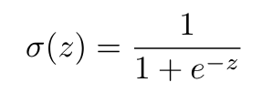
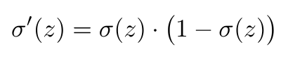
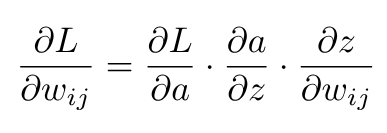

# Mi Primera Red Neuronal en Python

Este proyecto implementa una red neuronal desde cero usando únicamente `numpy`.  
El objetivo es mostrar, paso a paso, cómo funciona una red neuronal y cómo se relaciona con el cálculo multivariado.

---

## Introducción

Una red neuronal artificial es un modelo matemático inspirado en el cerebro humano.  
Se compone de capas de neuronas artificiales, que transforman datos de entrada en una salida.

Estructura típica:

1. **Capa de entrada** → recibe los datos (x₁, x₂, ...).  
2. **Capas ocultas** → procesan y aprenden representaciones intermedias.  
3. **Capa de salida** → da el resultado final (ejemplo: 0 o 1).  

---

## Relación con Cálculo Multivariado

Las redes neuronales están directamente relacionadas con conceptos de cálculo multivariado:

- La red es una **función multivariable**:  
  f(x; W, b)

- El entrenamiento consiste en **optimizar una función multivariable**:  
  minimizar la función de pérdida L(W, b).

- Conceptos aplicados:
  - **Derivadas parciales**: cómo cambia el error respecto a cada peso.  
  - **Gradiente**: vector que agrupa todas las derivadas parciales.  
  - **Regla de la cadena**: utilizada en backpropagation para derivar funciones compuestas.  
  - **Optimización**: gradiente descendente para encontrar mínimos locales.  

---

## Flujo de funcionamiento

### Diagrama conceptual

X → [W1, b1] → Sigmoide → a1 → [W2, b2] → Sigmoide → a2 → 
Comparación con y → Pérdida L → Gradientes → Actualización → Repetir

---

## Pasos matemáticos

1. **Propagación hacia adelante (Forward Pass)**  
   - Operación lineal:  
   <p align="center">
     
   </p>

   - Activación no lineal (sigmoide):  
   <p align="center">
     
   </p>

2. **Derivada de la sigmoide**  
   <p align="center">
     
   </p>

3. **Función de pérdida (Error cuadrático medio)**  
   <p align="center">
     
   </p>

4. **Backpropagation (Regla de la cadena)**  
   <p align="center">
     
   </p>

5. **Actualización de parámetros (Gradiente descendente)**  
   <p align="center">
     
   </p>

---

## Código explicado (`src/red.py`)

### Funciones de activación
```python
def sigmoid(x): 
    return 1 / (1 + np.exp(-x))

def sigmoid_deriv(x): 
    return x * (1 - x)
